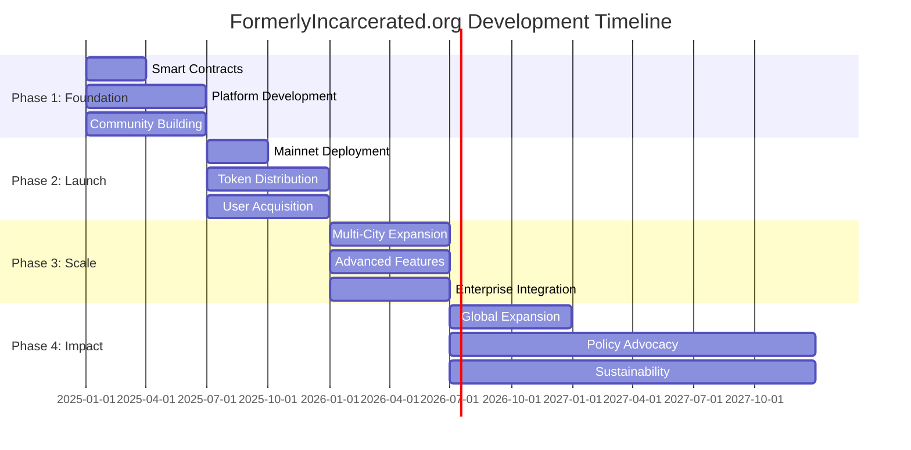

# Development Roadmap
## Building Second Chances Through Technology

Our roadmap outlines the strategic development plan for FormerlyIncarcerated.org over 24 months, structured in four phases that build upon each other to create a comprehensive ecosystem for empowerment and opportunity.

---

## 🗓️ Timeline Overview

---

## 🏗️ Phase 1: Foundation & Infrastructure
**Q1 - Q2 2025 (6 months)**

### 🎯 Core Objectives
- Establish technical foundation and security framework
- Build initial community and advisory structure
- Develop core platform features and user experience
- Create governance mechanisms and community guidelines

### 🔧 Key Deliverables

#### Technical Development
- ✅ Smart contract development and auditing
- ✅ Frontend application with Web3 integration
- ✅ Backend infrastructure and APIs
- ✅ Security framework and privacy controls

#### Community Building
- ✅ Advisory board formation (15 members)
- ✅ Community guidelines and governance framework
- ✅ Initial partnerships (10 organizations)
- ✅ Beta user recruitment (100 participants)

#### Funding & Resources
- ✅ Seed funding round ($2M target)
- ✅ Grant funding secured ($500K)
- ✅ Treasury management systems
- ✅ Legal and compliance framework

### 📈 Success Metrics
- **100 beta users** onboarded and active
- **Smart contracts audited** with no critical issues
- **10 strategic partnerships** established
- **Advisory board** fully operational

---

## 🚀 Phase 2: Launch & Early Adoption
**Q3 - Q4 2025 (6 months)**

### 🎯 Core Objectives
- Launch platform to public with core features
- Activate community governance and decision-making
- Demonstrate initial impact and user adoption
- Establish sustainable operational processes

### 🔧 Key Deliverables

#### Platform Launch
- 🚀 Mainnet deployment and public launch
- 🚀 Core features: identity, credentials, job matching
- 🚀 DAO governance activation
- 🚀 Token distribution and DEX listings

#### Feature Development
- 🚀 Enhanced identity and privacy controls
- 🚀 Skill verification NFT system
- 🚀 Micro-lending protocol launch
- 🚀 Community forums and communication

#### Growth & Adoption
- 🚀 Marketing and outreach campaigns
- 🚀 User onboarding optimization
- 🚀 Mentorship program launch
- 🚀 Employer partnership expansion

### 📈 Success Metrics
- **1,000 active users** registered
- **50 successful job placements**
- **10 community proposals** passed
- **$100K in community funding** allocated

---

## 📈 Phase 3: Scale & Expansion
**Q1 - Q2 2026 (6 months)**

### 🎯 Core Objectives
- Scale platform to serve 10,000+ users
- Expand to multiple cities and regions
- Integrate advanced DeFi and Web3 features
- Demonstrate measurable social impact

### 🔧 Key Deliverables

#### Platform Scaling
- 📱 Mobile application launch (iOS/Android)
- 🌐 Multi-chain architecture implementation
- 🤖 AI-powered matching algorithms
- 📊 Advanced analytics and reporting

#### Geographic Expansion
- 🏙️ Expansion to 5 major metropolitan areas
- 🤝 Local partnership development
- 🏛️ Government integration and compliance
- 🌍 Regional customization and localization

#### Advanced Features
- 💰 Investment DAOs and yield farming
- 🔗 Cross-chain interoperability
- 🏢 Enterprise dashboard and APIs
- 📈 Advanced lending and DeFi integration

### 📈 Success Metrics
- **10,000 active users** across 5 cities
- **500 businesses launched** with platform support
- **25% reduction in recidivism** among participants
- **$1M in community funding** allocated

---

## 🌍 Phase 4: Global Impact & Sustainability
**Q3 2026 and beyond**

### 🎯 Core Objectives
- Achieve global reach and impact
- Establish self-sustaining economic model
- Influence policy and systemic change
- Create lasting social transformation

### 🔧 Key Deliverables

#### Global Expansion
- 🌏 International market expansion (3 countries)
- 🗣️ Multi-language platform support (5 languages)
- 📚 Research publication and advocacy
- 🏛️ Policy influence and systemic change

#### Sustainability & Innovation
- 💼 Self-sustaining economic model
- 🏛️ Full DAO governance transition
- 🔬 Continuous technology innovation
- 🌱 Community ownership and control

#### Long-term Impact
- 📊 Measurable social outcomes
- 🔄 Systemic change and replication
- 🎓 Academic research and validation
- 🌟 Industry standard development

### 📈 Success Metrics
- **50,000 active users** globally
- **2,000 successful businesses** launched
- **50% reduction in recidivism**
- **$10M in annual community funding**

---

## 📊 Key Performance Indicators

### User Engagement
| Metric | Phase 1 | Phase 2 | Phase 3 | Phase 4 |
|--------|---------|---------|---------|---------|
| Active Users | 100 | 1,000 | 10,000 | 50,000 |
| Job Placements | 10 | 50 | 1,000 | 5,000 |
| Businesses Launched | 2 | 10 | 500 | 2,000 |
| Community Funding | $10K | $100K | $1M | $10M |

### Social Impact
| Metric | Target | Measurement |
|--------|--------|-------------|
| Recidivism Reduction | 50% | Compared to national average |
| Wage Increase | 40% | Compared to traditional programs |
| User Satisfaction | 90% | Quarterly surveys |
| Employer Satisfaction | 85% | Partner feedback |

### Platform Health
| Metric | Target | Frequency |
|--------|--------|-----------|
| Governance Participation | 60% | Monthly voting |
| Technical Uptime | 99.9% | Continuous monitoring |
| Security Incidents | 0 | Critical vulnerabilities |
| Community Growth | 20% | Monthly user acquisition |

---

## 🤝 Get Involved

### 👩‍💻 For Developers
- **Contribute** to open-source development
- **Join** our technical advisory committee
- **Participate** in hackathons and bounties
- **Help** with security audits and testing

### 🏘️ For Community Members
- **Join** our beta testing program
- **Participate** in governance decisions
- **Become** a community ambassador
- **Provide** feedback and suggestions

### 🤝 For Partners
- **Integrate** your services with our platform
- **Provide** funding or resources
- **Offer** employment opportunities
- **Support** policy advocacy efforts

### 💼 For Investors
- **Participate** in funding rounds
- **Provide** strategic guidance
- **Connect** us with potential partners
- **Support** our mission and vision

---

## 📞 Stay Connected

- **📧 Email Updates**: [roadmap@formerlyincarcerated.org](mailto:roadmap@formerlyincarcerated.org)
- **📱 Community Discord**: [Join our community](https://discord.gg/formerly-incarcerated-empowerment)
- **📰 Newsletter**: [Subscribe for updates](https://formerlyincarcerated.org/newsletter)
- **📊 Progress Dashboard**: [Track our progress](https://formerlyincarcerated.org/progress)

---

## 📋 Roadmap Updates

This roadmap is a living document that evolves based on:
- **Community feedback** and governance decisions
- **Technological developments** and opportunities
- **Market conditions** and regulatory changes
- **Impact measurement** and learning outcomes

**Last Updated**: December 2024  
**Next Review**: March 2025  
**Version**: 1.0

---

*Join us in building a more just and equitable future through technology, community, and hope.*
